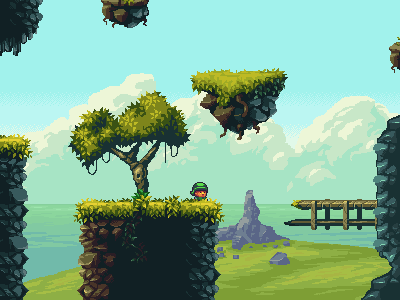

# Rainbow Joe
## About
Rainbow Joe is a classic 2D platformer game in the spirit of the 1990s written
in C using SDL2 and the
[TMX Map Format](http://doc.mapeditor.org/en/stable/reference/tmx-map-format/)
(Tile Map XML).  It is also a constantly evolving project I work on to exercise
C programming and to learn about the basic concepts of game development.

Last but not least: follow-on project of
[Janitor Jamboree](https://github.com/mupfelofen-de/janitor-jamboree) which I
have discarded.

### Trivia
The quite odd game title was generated using
[The Video Game Name Generator](https://www.videogamena.me/).

## Why C?

A question I hear alot is why I'm using C for this project instead of a modern
language like Rust, Haskell or `[insert your preferred language here]`, because
writing games in C is neither a easy thing to do nor very common (these days).

The main reason is obvious and I already mentioned it in the introduction: to
get exercise in C programming.  And writing a game in C seemed like a fun way
of getting some.

Nevertheless: I hope you find the code of this project useful.  If so, feel free
to use it in any way you want. Just consider buying me a beer in case we meet
someday.

## Screenshot
Click to open in full-resolution.
[](media/screenshot.png?raw=true "Screenshot")

## Dependencies and how to compile
The program has been successfully compiled with the following libraries:
```
libxml2    2.9.8
sdl2       2.0.8
sdl2_image 2.0.3
sdl2_mixer 2.0.2
zlib       1.2.11
```

To compile _Rainbow Joe_ under Linux simply enter:
```
make
```

To generate the documentation using doxygen enter:
```
doxygen
```

## Releases
There are also **Windows** builds that can be found here:
[Releases](https://github.com/mupfelofen-de/rainbow-joe/releases).

## Controls

```
A:      move left
D:      move right
ESCAPE: pause
LSHIFT: hold to run
SPACE:  jump / unpause
1:      set default zoom level
2:      zoom out
3:      zoom in
F:      hold to move camera freely
UP:     move camera up
DOWN:   move camera down
LEFT:   move camera left
RIGHT:  move camera right
Q:      quit
```

## License
This project is licenced under the "THE BEER-WARE LICENCE".  See the file
[LICENCE.md](LICENCE.md) for details.

[TMX C Loader](https://github.com/baylej/tmx/) by Bayle Jonathan is licenced
under a BSD 2-Clause "Simplified" Licence.  See the file
[COPYING](src/tmx/COPYING) for details.

[inih](https://github.com/benhoyt/inih) by Ben Hoyt is licensed the
New BSD licence.  See the file [LICENSE.txt](src/inih/LICENSE.txt) for
details.

[Magic Cliffs Environment](http://pixelgameart.org/web/portfolio/magic-cliffs-environment/)
by [Luis Zun aka ansimuz](https://www.patreon.com/ansimuz).  Licenced under 
[CC BY 4.0](https://creativecommons.org/licenses/by/4.0/).

All other graphic, sound & music resources are dedicated to
[public domain](https://creativecommons.org/publicdomain/zero/1.0/) and have
been found on [OpenGameArt.org](https://opengameart.org/).
